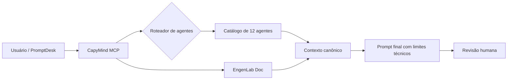

<p align="center">
  
</p>

<p align="center">
  <strong>A camada de inteligência operacional para o EngenLab PromptDesk.</strong><br />
  Organiza conhecimento técnico, roteia agentes, entrega contexto rastreável e mantém limites de segurança para fluxos de IA.
</p>

<p align="center">
  <a href="#visão-geral">Visão geral</a> ·
  <a href="#como-funciona">Como funciona</a> ·
  <a href="#capymind-engenlab-mcp">MCP</a> ·
  <a href="#catálogo-de-agentes">Agentes</a> ·
  <a href="#promptdesk">PromptDesk</a> ·
  <a href="#segurança-técnica">Segurança</a>
</p>

<p align="center">
  
  
  
  
  
</p>

---

## Visão geral

**CapyMind** é um knowledge pack `docs-as-code` criado para servir como base de contexto para IAs, MCP servers, automações e apps operacionais.

No fluxo atual, ele funciona como o cérebro técnico do **EngenLab PromptDesk**: recebe uma intenção do usuário, identifica o melhor agente, injeta o contexto correto e devolve uma saída pronta para revisão humana.

<table>
<tr>
<td width="33%" valign="top">

### Contexto canônico

Documentos versionados com regras, limites, metadados e instruções fixas para agentes.

</td>
<td width="33%" valign="top">

### MCP operacional

Servidor HTTP com tools para consulta, roteamento, contexto e catálogo de agentes.

</td>
<td width="33%" valign="top">

### PromptDesk-ready

Catálogo de agentes pronto para desktop, ChatGPT Apps e futuras sincronizações via MCP.

</td>
</tr>
</table>

---

## Como funciona



O CapyMind não tenta ser “mais uma pasta de prompts”. Ele funciona como uma **camada de governança operacional** entre o usuário, o app e os agentes especializados.

---

## O que ele resolve

| Problema | Solução com CapyMind |
|---|---|
| Prompts soltos e difíceis de manter | Contextos canônicos por agente e módulo. |
| Biblioteca técnica grande demais para navegar manualmente | Roteamento por tarefa, disciplina, módulo e palavras-chave. |
| Respostas técnicas sem limite claro | Aviso obrigatório e política de uso preliminar/revisável. |
| App desktop desconectado da base de conhecimento | Catálogo local ou sincronização futura via MCP. |
| Agentes duplicados ou inconsistentes | `agent_id`, `sourceDocument`, comandos rápidos e prompt fixo. |

---

## CapyMind EngenLab MCP

O servidor MCP principal fica em:

```txt
apps/capymind-engelab-mcp/
```

### Stack

<p>
  
  
  
  
  
</p>

### Endpoints

| Endpoint | Uso |
|---|---|
| `GET /health` | Verifica se o servidor está ativo. |
| `POST /mcp` | Endpoint MCP Streamable HTTP. |

### Rodar localmente

```bash
cd apps/capymind-engelab-mcp
npm install
npm run build
npm run dev
```

Teste rápido:

```bash
curl http://localhost:3000/health
```

---

## Tools MCP

| Tool | O que faz |
|---|---|
| `get_safety_notice` | Retorna o aviso técnico obrigatório. |
| `list_engelab_projects` | Lista grupos de projetos-modelo da biblioteca EngenLab Doc. |
| `search_engelab_doc` | Busca metadados curados da biblioteca. |
| `get_project_context` | Retorna contexto estruturado de um grupo de projetos. |
| `build_agent_context` | Monta pacote de contexto para outro agente/GPT. |
| `list_agent_catalog` | Lista o catálogo PromptDesk. |
| `get_agent_context` | Retorna system prompt e configuração por `agent_id`. |
| `route_agent_for_task` | Seleciona o melhor agente para uma tarefa. |
| `get_structural_agent_context` | Atalho para o agente de Estruturas Módulo 15. |

<details>
<summary><strong>Exemplo de roteamento</strong></summary>

Entrada:

```json
{
  "task": "montar cronograma preliminar de obra",
  "includeContext": true
}
```

Agente esperado:

```txt
engenlab-planejamento-obra-ia-modulo-12
```

</details>

---

## Catálogo de agentes

O CapyMind expõe **12 agentes técnicos educacionais** organizados por módulo da biblioteca EngenLab.

<table>
<tr>
<td width="50%" valign="top">

### Projetos-modelo

- `engenlab-estrutural-projetos-ia-01`
- `engenlab-eletrico-projetos-ia-02`
- `engenlab-hidrossanitario-projetos-ia-03`

</td>
<td width="50%" valign="top">

### Prompts e BIM

- `engenlab-prompts-modulares-ia-04`
- `engenlab-revit-prompt-ia-08`
- `engenlab-calculo-estrutural-ia-09`

</td>
</tr>
<tr>
<td width="50%" valign="top">

### Obra e documentação

- `engenlab-compatibilizacao-ia-modulo-10`
- `engenlab-orcamentos-quantitativos-ia-modulo-11`
- `engenlab-planejamento-obra-ia-modulo-12`

</td>
<td width="50%" valign="top">

### Relatórios, segurança e estruturas

- `engenlab-vistorias-relatorios-ia-modulo-13`
- `engenlab-seguranca-trabalho-obras-ia-modulo-14`
- `engenlab-estruturas-ia-modulo-15`

</td>
</tr>
</table>

<details>
<summary><strong>Ver tabela completa dos agentes</strong></summary>

| # | Agente | Módulo | Especialidade |
|---:|---|---|---|
| 1 | `engenlab-estrutural-projetos-ia-01` | `01_ESTRUTURAL` | Projetos estruturais, pranchas, memoriais e checklists. |
| 2 | `engenlab-eletrico-projetos-ia-02` | `02_ELETRICO` | Instalações elétricas, circuitos, pontos e quadros. |
| 3 | `engenlab-hidrossanitario-projetos-ia-03` | `03_HIDROSSANITARIO` | Água, esgoto, ventilação e compatibilização. |
| 4 | `engenlab-prompts-modulares-ia-04` | `04_PROMPTS_MODULARES` | Prompts técnicos modulares e padrões de saída. |
| 5 | `engenlab-revit-prompt-ia-08` | `08_BONUS/PROMPT_REVIT` | Revit/BIM, vistas, famílias, parâmetros e pranchas. |
| 6 | `engenlab-calculo-estrutural-ia-09` | `09_CALCULO_ESTRUTURAL_IA` | Hipóteses, checklists e apoio educacional ao cálculo. |
| 7 | `engenlab-compatibilizacao-ia-modulo-10` | `Módulo 10` | Interferências e compatibilização técnica. |
| 8 | `engenlab-orcamentos-quantitativos-ia-modulo-11` | `Módulo 11` | Quantitativos, insumos e orçamento preliminar. |
| 9 | `engenlab-planejamento-obra-ia-modulo-12` | `Módulo 12` | EAP, cronograma conceitual, riscos e sequência. |
| 10 | `engenlab-vistorias-relatorios-ia-modulo-13` | `Módulo 13` | Vistorias, evidências e relatórios preliminares. |
| 11 | `engenlab-seguranca-trabalho-obras-ia-modulo-14` | `Módulo 14` | SST, riscos aparentes, checklists e roteiros. |
| 12 | `engenlab-estruturas-ia-modulo-15` | `Módulo 15` | Estruturas com IA, memoriais, relatórios e pranchas. |

</details>

---

## PromptDesk

O EngenLab PromptDesk pode usar o CapyMind em dois modos.

<table>
<tr>
<td width="50%" valign="top">

### Modo local

Catálogo embutido no app desktop.

Indicado para:

- MVP;
- uso offline;
- resposta rápida;
- menor dependência externa.

</td>
<td width="50%" valign="top">

### Modo MCP

Sincronização remota via `/mcp`.

Indicado para:

- atualização centralizada;
- múltiplos clientes;
- ChatGPT Apps;
- catálogo vivo de agentes.

</td>
</tr>
</table>

---

## Segurança técnica

> Este material é um apoio educacional, preliminar e de organização técnica. Não constitui projeto executivo, cálculo estrutural final, laudo, ART/RRT, aprovação legal ou substituição de profissional habilitado.

CapyMind acelera organização, prompts, checklists, roteiros e documentação preliminar. A validação final deve ser feita por profissional habilitado sempre que houver impacto técnico, legal, financeiro ou de segurança.

---

## Demonstração rápida

### Listar agentes

```txt
Use o CapyMind EngenLab para listar o catálogo de agentes disponíveis.
```

### Buscar contexto de agente

```txt
Use o CapyMind EngenLab para retornar o contexto do agente engenlab-revit-prompt-ia-08.
```

### Roteamento por tarefa

```txt
Use o CapyMind EngenLab para escolher o melhor agente para: criar checklist de segurança para etapa de concretagem.
```

---

<p align="center">
  
</p>

<p align="center">
  <strong>CapyMind</strong><br />
  Organiza conhecimento. Roteia agentes. Entrega contexto. Mantém limites técnicos.
</p>
